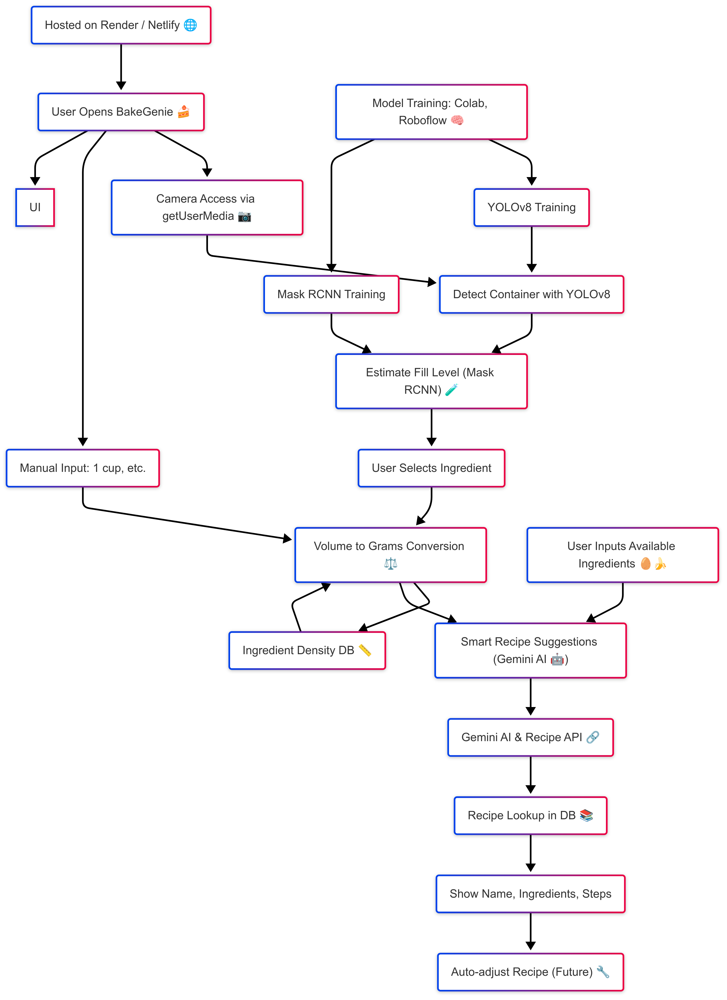
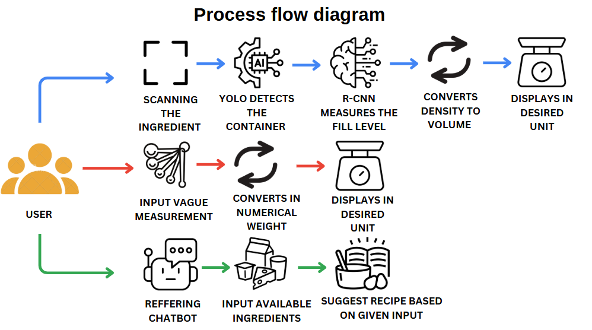

# BakeGenie — AI-powered Precision Baking Web App

BakeGenie is a web-based application that brings professional-grade precision into home baking. It combines computer vision, AI-based ingredient conversion, and recipe recommendation systems to help users measure ingredients accurately and explore new recipes based on their available ingredients.

Built with a minimalistic and clean UI, BakeGenie is designed for efficiency, accuracy, and an enjoyable baking experience.

## 📌 Features

- **📸 AI Ingredient Measurement**

  - Real-time container detection (cups, bowls, spoons) using a custom-trained YOLOv8 model.
  - (WIP) Fill-level estimation using Mask R-CNN to predict the amount inside the container.
  - Converts detected volume to gram measurements based on a dynamic ingredient density database.

- **🧮 Ingredient Conversion (Manual Input)**

  - Users manually select container size and ingredient type to get accurate gram equivalents.
  - Supports conversion for a wide variety of ingredients like flour, sugar, butter, milk, etc.

- **🤖 Smart Recipe Recommendations**
  - Users input available ingredients.
  - Gemini API-powered chatbot suggests personalized recipes.
- **📚 Recipe Database Integration**

  - Backend-ready integration of a processed Kaggle dataset with 200K+ recipes. (working on migrating from sample data to full Kaggle dataset)
  - Search and display of detailed recipes, ingredients, and steps (currently sample database active).

- **🛠️ Recipe Adjustment (Future)**

  - Automatically scale recipe quantities based on available ingredient amounts.

- **🎵 Productivity Enhancements (Planned)**
  - Optional ambient sounds for a focused, fun baking environment.

## 🚀 Tech Stack

### Frontend

- **HTML, CSS, JavaScript**
- **getUserMedia API** (Web Camera access)
- **Custom Vanilla JS Logic** (Dynamic UI interactions)

### Backend

- **Python (Flask or FastAPI)** — Web server and API endpoints
- **YOLOv8 (Ultralytics)** — Real-time container detection
- **Mask RCNN** (Training in Progress) — Container fill-level estimation
- **Ingredient Density Engine** — Converts volume to mass for different ingredients
- **Gemini API** — AI chatbot integration for recipe suggestions

### Database

- **Local JSON DB** — For ingredient densities
- **Sample Recipes JSON DB** (Migrating to full Kaggle 200K+ recipes)

### Tools & Infrastructure

- **Google Colab + Roboflow** — Model training and augmentation
- **Render ** — Hosting
- **GitHub** — Version control
- **Figma** — UI prototyping
- **Firebase** _(planned)_ — User authentication and storage (optional future integration)

## 🏗️ Project Architecture


---------------------------------------


## ⚡ Future Enhancements

- 🔬 Real-time fill-level prediction using instance segmentation on mobile.
- 📱 Build a PWA (Progressive Web App) version.
- 🧠 Fine-tune AI chatbot specifically for baking advice and nutritional breakdown.
- 🔗 Connect with smart scales and kitchen appliances.
- 📥 Allow users to save, modify, and share custom recipes.
- 🎤 Voice-command based baking assistant.
- 🍎 Nutrition value calculator based on ingredients.

## 🛠️ Installation & Setup

> Prerequisites: Python 3.10, Node.js (for frontend local server), pip

1. **Clone the repository**

   ```bash
   git clone https://github.com/surajsinghshekhawat/BakeGenie
   cd bakegenie
   ```

2. **Install backend dependencies**

   ```bash
   pip install -r requirements.txt
   ```

3. **Run backend server**

   ```bash
   python app.py
   ```

4. **Run frontend**

   ```bash
   cd frontend
   npm install
   npm start
   ```

5. **Access the app**
   - Open browser and navigate to: `http://localhost:3000`

---

## 🤝 Contribution Guidelines

- Fork this repo
- Create a new branch (`git checkout -b feature/yourFeature`)
- Commit your changes (`git commit -m 'Add some feature'`)
- Push to the branch (`git push origin feature/yourFeature`)
- Open a Pull Request 🚀

---

## 📜 License

Distributed under the MIT License.  
See `LICENSE` for more information.
